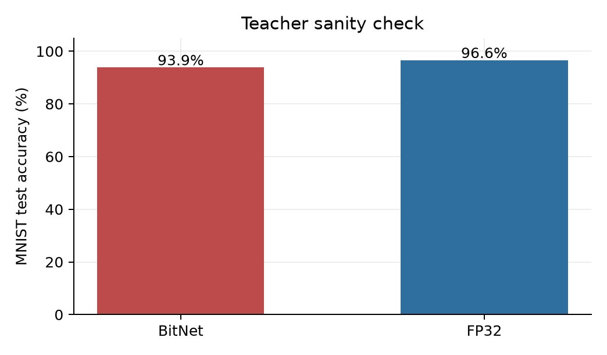
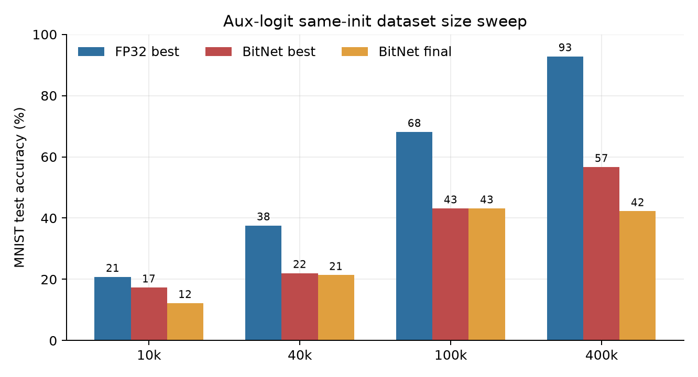
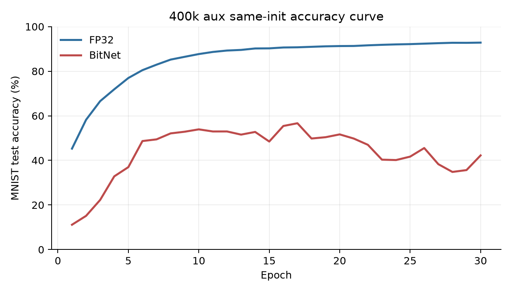
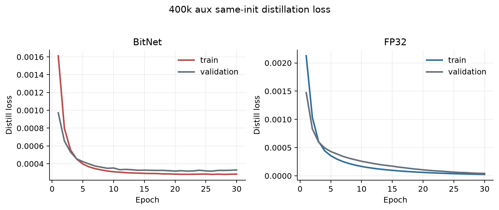
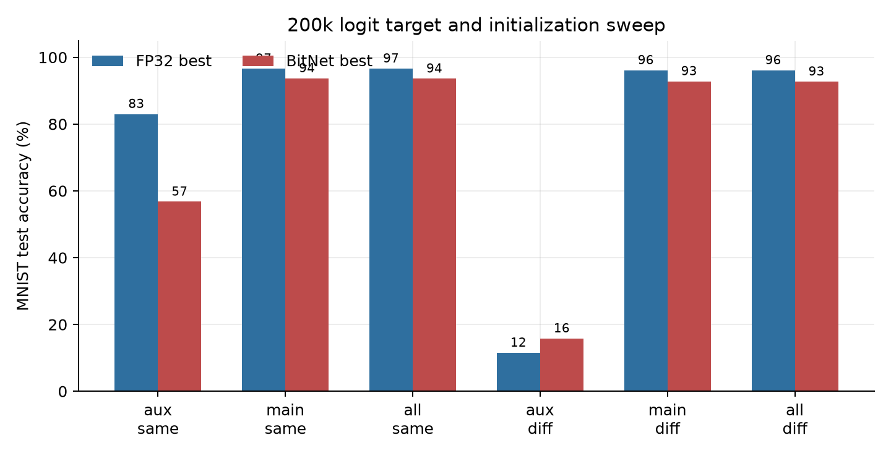
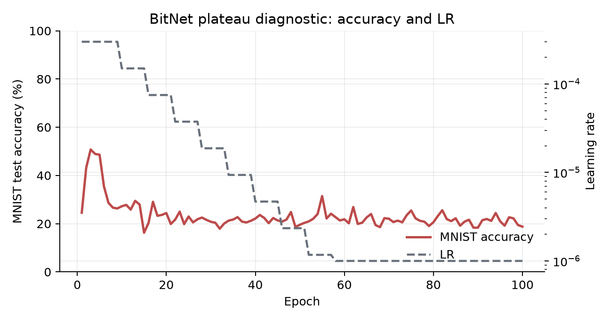
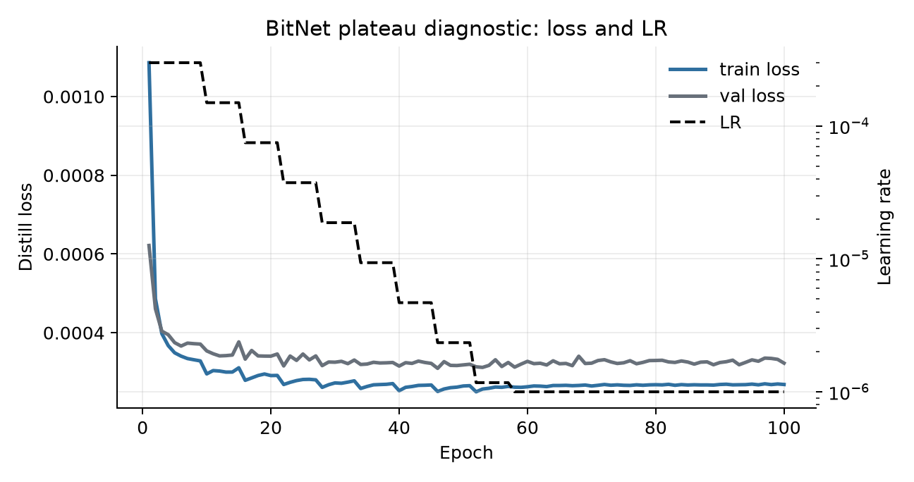
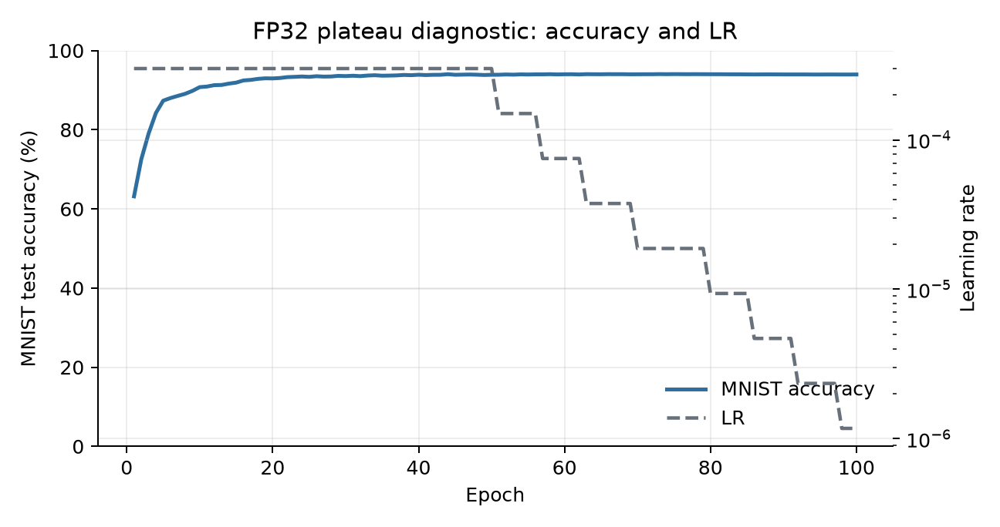
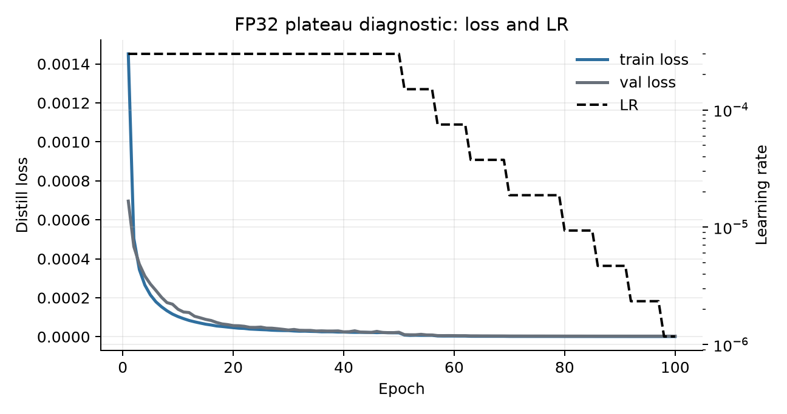

# BitNet MLP Subliminal Learning Results

## Setup

| Item | FP32 MLP | BitNet-style MLP |
|---|---:|---:|
| Architecture | `784 -> 256 -> 256 -> 13` | `784 -> 256 -> 256 -> 13` |
| Hidden layers | `nn.Linear + ReLU` | `BitLinear + ReLU` |
| Main logits | first 10 | first 10 |
| Aux logits | last 3 | last 3 |
| Teacher training | MNIST CE, 5 epochs | MNIST CE, 5 epochs |
| Student training | KL on cached teacher logits, 30 epochs | KL on cached teacher logits, 30 epochs |
| Optimizer | Adam | Adam |
| Teacher LR | `1e-3` | `1e-3` |
| Student LR | `1e-4` | `1e-4` |
| Batch size | `256` | `256` |
| MNIST/noise range | `[-1, 1]` | `[-1, 1]` |
| Validation split | 20% of MNIST train/noise cache | 20% of MNIST train/noise cache |

Run folders:

- BitNet centered run: `run_3_bitnet_mlp_centered_minus1to1`
- FP32 centered run: `run_4_fp32_mlp_centered_minus1to1`
- Earlier BitNet `[0,1]` run: `run_2_student_lr1e-4_input0to1_baseline`

## Teacher Check

Both teachers learn MNIST before any subliminal-transfer experiment.

| Teacher | Final test accuracy |
|---|---:|
| BitNet-style MLP | 93.86% |
| FP32 MLP | 96.61% |

## Dataset Size Sweep

Same-init students were trained only on auxiliary logits from random noise.

| Noise samples | FP32 best | FP32 final | BitNet best | BitNet final |
|---:|---:|---:|---:|---:|
| 10k | 20.78% | 20.73% | 17.30% | 12.22% |
| 40k | 37.58% | 36.82% | 22.03% | 21.36% |
| 100k | 68.12% | 68.12% | 43.13% | 43.13% |
| 400k | 92.82% | 92.82% | 56.66% | 42.23% |

Observation: BitNet does transmit the auxiliary signal, but it is weaker and less stable than FP32. The 400k BitNet run reaches 56.66% but ends at 42.23%, so best epoch matters.

## 400k Aux Same-Init Curve

This is the clearest dataset-size comparison. FP32 keeps climbing to high accuracy. BitNet rises quickly, peaks around the middle, then drops.

The distillation losses continue to decrease for both models, so lower KL loss does not directly mean better MNIST accuracy.

## 200k Target / Initialization Sweep

| Target / init | FP32 best | BitNet best |
|---|---:|---:|
| Aux, same init | 83.00% | 56.75% |
| Main, same init | 96.58% | 93.68% |
| All, same init | 96.60% | 93.60% |
| Aux, different init | 11.52% | 15.81% |
| Main, different init | 96.09% | 92.80% |
| All, different init | 96.08% | 92.70% |

Observation: main/all logits transfer normally in both models. The interesting gap is aux-only transfer: FP32 is much stronger under same initialization, while different initialization stays near low accuracy.

## Plateau Stress Test

Stress test: 400k aux same-init, LR `3e-4`, `ReduceLROnPlateau`, 100 epochs.

| Model | Best accuracy | Best epoch | Final accuracy |
|---|---:|---:|---:|
| BitNet-style MLP | 50.76% | 3 | 18.78% |
| FP32 MLP | 94.05% | 73 | 93.96% |

The BitNet stress run still collapses. Lowering LR on plateau did not rescue it. A better follow-up is to resume from the best-accuracy checkpoint with a smaller LR.

FP32 remains stable in the same diagnostic.

## Preprocessing Note

The earlier BitNet run used MNIST/noise in `[0,1]`. It showed much weaker transfer.

| Noise samples | BitNet `[0,1]` best | BitNet `[-1,1]` best |
|---:|---:|---:|
| 10k | 9.14% | 17.30% |
| 40k | 9.82% | 22.03% |
| 100k | 16.72% | 43.13% |
| 400k | 12.42% | 56.66% |

This should be treated as a methodological note, not the main comparison. The main FP32-vs-BitNet comparison uses the centered `[-1,1]` setup for both models.

## Takeaway

Subliminal learning survives in the BitNet-style MLP, but it is attenuated and less stable than in the FP32 MLP. The result is not just random chance: with centered inputs and enough noise samples, aux-only same-init BitNet students reach well above chance. The gap is that FP32 transfers the hidden signal much more cleanly and remains stable for longer.
